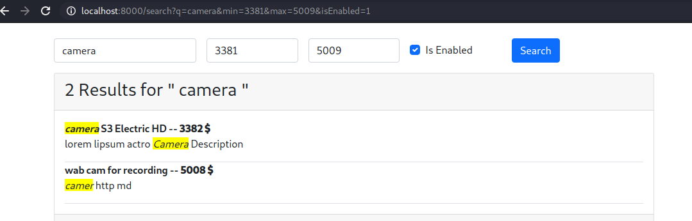

**This project is about implementation of Algolia engine in symfony applicatoin**

# What is Algolia?
Algolia is a hosted search engine, offering full-text, numerical, and faceted search, capable of delivering real-time results from the first keystroke. Algolia’s powerful API lets you quickly and seamlessly implement search within your websites and mobile applications. Our search API powers billions of queries for thousands of companies every month, delivering relevant results in under 100ms anywhere in the world.

